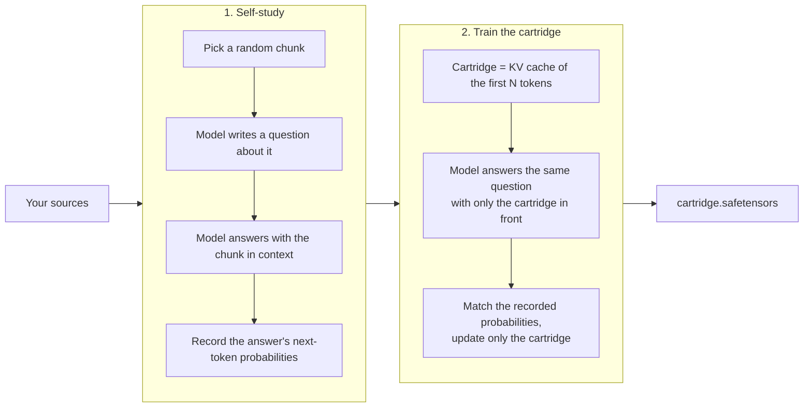

<h1 align="center">kvpack</h1>

<p align="center">
  <b>Pack a repo, a docs site or a folder into a trained KV cache.</b><br>
  Your model reads it instead of a giant prompt. Open source, runs on your own hardware.
</p>

<p align="center">
  <a href="https://github.com/Numoy/kvpack/actions/workflows/ci.yml"></a>
  <a href="LICENSE"></a>
  
</p>

> **Status: early and research-grade.** kvpack is a readable, runnable implementation of
> [Cartridges](https://arxiv.org/abs/2506.06266) with an honest benchmark. On small models
> a cartridge alone still recalls less than RAG, as shown [below](#where-it-stands).
> Results at larger scale, and batched serving, are next.

---

When a language model reads a document, it turns every token into key and value vectors
in every layer: the **KV cache**. Everything it later "knows" about the document, it
reads from that cache.

**kvpack trains a small KV cache directly.** A few hundred or thousand cached positions
end up carrying what the model would otherwise need the whole document in its prompt
for. We call the result a **cartridge**: one file you load in front of any conversation.
It has a fixed memory cost however large the documents are, and there's nothing to
prefill or retrieve per request.

```bash
pip install git+https://github.com/Numoy/kvpack

kvpack build https://github.com/your-org/handbook      # a repo, a docs site or a folder
kvpack chat handbook.safetensors                         # ask it anything
kvpack serve handbook.safetensors                        # OpenAI-compatible API
kvpack sync handbook.safetensors                         # rebuild only if the repo changed
```

The method comes from the paper
[*Cartridges: Lightweight and general-purpose long context representations via self-study*](https://arxiv.org/abs/2506.06266)
(Eyuboglu et al., ICLR 2026), which reports matching in-context quality with **38.6× less
memory** and **26.4× more throughput** on long-document benchmarks. kvpack makes it a tool:
connectors, a CLI, an OpenAI-compatible server, an evaluation harness and a self-hosted
web app. It works with any open-weight Llama- or Qwen3-style model from Hugging Face.

## Where it stands

We benchmark every change against RAG and the full document. Here's the setup that runs
on a laptop: Qwen3-0.6B, a 2,341-token manual the model has never seen, and 28 fact
questions.

<p align="center"></p>

- **A cartridge alone is fast and small but lossy.** It had the fastest first token of
  any setup that knows the document, and took the model from 0 to 12 correct answers (16
  with a 4× larger cartridge). RAG gets 24, even with the same memory.
- **A cartridge plus one retrieved chunk matches the best of everything:** 25/28, the
  same as the full document and the best RAG setup, with a fifth of the full document's
  memory and a faster first token than RAG at equal memory.
- **Small model, small budget.** These runs use a 0.6B model and 384 practice
  conversations. The paper uses 4B–8B models and thousands. We'll publish larger runs
  here as we make them ([one command](scripts/modal_benchmark.py) on a cloud GPU).

So: use a cartridge where memory per conversation, time to first token or running a
retrieval stack is the bottleneck, and add retrieval on top when exact facts matter.
`kvpack eval` shows which setup wins on *your* documents and questions.
[Reproduce the benchmark](#reproduce-the-benchmark).

## Connect your knowledge

A cartridge is defined by its sources, and it remembers them:

| Source | Example | What kvpack reads |
| --- | --- | --- |
| Folder or file | `./handbook`, `notes.pdf` | Every text file (Markdown, HTML, code, PDF, ...), skipping hidden and dependency folders |
| Git repository | `https://github.com/org/repo`, `git+https://git.company.dev/docs.git` | A shallow clone of the default branch |
| Website | `https://docs.example.com/guide/` | That page and every page linked below its path, using the sitemap and respecting robots.txt |

```bash
# several sources in one cartridge
kvpack build ./policies https://github.com/acme/runbooks https://docs.acme.dev/api/ --name acme

# keep it fresh: fetches the recorded sources and rebuilds only when something changed
kvpack sync acme.safetensors
```

`kvpack sync` is safe to run from cron. When nothing changed it exits after fetching, and
a rebuild replaces the file in one step, so a running `kvpack serve` picks up the new
version without a restart. For private repositories, put a token in an environment
variable and name it in Python (`GitSource(url, token_env="GITHUB_TOKEN")`). Only the
variable's name is stored.

Adding a connector (Notion, Google Drive, Confluence, ...) means one class with a
`fetch()` method. See [`sources.py`](src/kvpack/sources.py). Contributions are very
welcome.

## kvpack Studio

[`studio/`](studio) is a self-hosted web app on top of the library, for teams that want
the workflow without the command line. You connect a Git repository, a website, a
server folder or uploaded files, and Studio builds the cartridge. It keeps the
cartridge in sync on a schedule, rebuilding only when the source changed and serving the
current version while a new one builds. Everything is available through an
OpenAI-compatible API with API keys.

<picture>
  <source media="(prefers-color-scheme: dark)" srcset="docs/assets/studio-connect-dark.png">
  
</picture>

```bash
cd studio && uv sync
uv run kvpack-studio serve          # then open http://127.0.0.1:8080 and create your account
```

It runs on one GPU machine, or on your own [Modal](https://modal.com) account with GPUs
that scale to zero. See the [Studio README](studio/README.md).

## Quickstart

The repository includes a fictional operations manual for an Antarctic research station,
[`examples/kestrel-station/manual.md`](examples/kestrel-station/manual.md). It's
invented, so no model has seen it in training, which makes it a fair test.

**1. Build a cartridge.** kvpack generates practice conversations about the document,
then trains the cartridge on them:

```bash
kvpack build examples/kestrel-station/manual.md \
  --model Qwen/Qwen3-4B --tokens 512 --samples 1024 --out kestrel.safetensors
```

**2. Check it** against RAG, the full document and no context, on 28 questions:

```bash
kvpack eval kestrel.safetensors --docs examples/kestrel-station/manual.md \
  -q examples/kestrel-station/questions.jsonl --setups cartridge,cartridge+rag,rag,full,none
```

**3. Chat with it, or serve it:**

```bash
kvpack chat kestrel.safetensors
kvpack serve kestrel.safetensors --port 8000
```

```python
from openai import OpenAI

client = OpenAI(base_url="http://localhost:8000/v1", api_key="none")
reply = client.chat.completions.create(
    model="kestrel",  # each cartridge appears as its own model
    messages=[{"role": "user", "content": "Describe the three-wash protocol."}],
)
print(reply.choices[0].message.content)
```

You need Python 3.11+ and PyTorch. kvpack runs on NVIDIA GPUs (CUDA), Apple Silicon (MPS)
and CPU. For PDFs, install the extra: `pip install "kvpack[pdf] @ git+https://github.com/Numoy/kvpack"`.

## How it works



**1. Self-study.** kvpack picks a random 512–1,024-token chunk of your documents and asks
the model to write a question about it, cycling through factual questions, summaries,
structured extraction, practical use cases and open-ended discussion. The model then
answers the question *with the chunk in its prompt*, and kvpack records the model's
top-20 next-token probabilities for every token of that answer.

**2. Training.** The cartridge starts as the real KV cache of the first N tokens of your
documents. The model's weights stay frozen. For each practice conversation, the model
sees only the cartridge and the question, and gradient descent adjusts the cartridge's
keys and values until the model's next-token probabilities match the recorded ones.
This is called *context distillation*: whatever the chunk taught the model, the cartridge
learns to teach it too.

**3. Inference.** A cartridge replaces the system prompt. kvpack builds a KV cache from it
and generates as usual, so there's nothing to prefill.

The code is small on purpose, and it's meant to be read:

| File | What it does |
| --- | --- |
| [`cartridge.py`](src/kvpack/cartridge.py) | The `Cartridge`: trainable keys/values, initialization from text, save/load |
| [`chat_format.py`](src/kvpack/chat_format.py) | Splits any chat template into "system prompt" and "everything after it" |
| [`sources.py`](src/kvpack/sources.py) | Folder, Git and website connectors, and change detection |
| [`synthesize.py`](src/kvpack/synthesize.py) | Self-study data generation, local or via any OpenAI-compatible server |
| [`train.py`](src/kvpack/train.py) | The distillation loss and training loop |
| [`benchmark.py`](src/kvpack/benchmark.py) | Cartridge vs RAG vs full context on your questions |
| [`server.py`](src/kvpack/server.py) | OpenAI-compatible HTTP server |

## Reproduce the benchmark

The chart comes from [`examples/kestrel-station`](examples/kestrel-station): a fictional
research-station manual and [28 questions](examples/kestrel-station/questions.jsonl),
each listing the facts a correct answer must contain. Grading is a strict keyword check,
and every answer is saved, so you can audit each call. On an M1 Max:

```bash
Q="--docs examples/kestrel-station/manual.md -q examples/kestrel-station/questions.jsonl"

# 384 self-study conversations (about an hour on the Mac), 4 epochs of training
kvpack build examples/kestrel-station/manual.md --model Qwen/Qwen3-0.6B \
  --tokens 256 --samples 384 --epochs 4 --save-data kestrel-data --out kestrel.safetensors

# cartridge vs RAG (4 BM25 chunks of 256 tokens) vs full document vs no context
kvpack eval kestrel.safetensors $Q -o eval.json

# RAG at the same memory budgets, and cartridge + 1 chunk
kvpack eval kestrel.safetensors $Q --setups rag --rag-chunks 1 -o eval-rag-256.json
kvpack eval kestrel.safetensors $Q --setups rag --rag-chunks 2 -o eval-rag-512.json
kvpack eval kestrel.safetensors $Q --setups cartridge+rag --rag-chunks 1 -o eval-hybrid.json

# a 4x larger cartridge from the same self-study data
kvpack build examples/kestrel-station/manual.md --model Qwen/Qwen3-0.6B \
  --tokens 1024 --data kestrel-data --epochs 4 --out kestrel-1024.safetensors
kvpack eval kestrel-1024.safetensors $Q --setups cartridge -o eval-1024.json

python scripts/benchmark_chart.py eval*.json -o benchmark.svg
```

(In zsh, write the `$Q` options out in full, or use `${=Q}`.)

| Setup | Correct | Context held | KV cache | Time to first token |
| --- | ---: | ---: | ---: | ---: |
| Full document | 25/28 | 2,341 tokens | 256 MiB | 1,129 ms |
| RAG, 4 chunks | 24/28 | 1,006 tokens | 110 MiB | 448 ms |
| RAG, 2 chunks | 25/28 | 507 tokens | 55 MiB | 273 ms |
| RAG, 1 chunk | 24/28 | 255 tokens | 28 MiB | 162 ms |
| **Cartridge (256) + 1 chunk** | **25/28** | **506 tokens** | **55 MiB** | **207 ms** |
| **Cartridge, 1,024 tokens** | **16/28** | **1,024 tokens** | **112 MiB** | **81 ms** |
| **Cartridge, 256 tokens** | **12/28** | **256 tokens** | **28 MiB** | **85 ms** |
| No context | 0/28 | 0 | 0 | 41 ms |

Qwen3-0.6B in bfloat16 on Apple Silicon. Time to first token is the median over the first
five questions and includes prefilling the context. The paper reports 38.6× less memory
than in-context learning at matching quality, with 26.4× more throughput, and effective
context extended from 128k to 484k tokens on MTOB, all with larger models. If you run
`kvpack eval` on your own data, please share the table in an issue.

## Choosing settings

| Setting | Default | Guidance |
| --- | --- | --- |
| `--tokens` | 2048 | Cartridge size. Memory grows linearly with it, and bigger cartridges hold more detail. The paper's headline result compresses corpora roughly 40×. |
| `--samples` | 1024 | Practice conversations. More samples cover the corpus better. The reference examples use about 8,000 per corpus. |
| `--epochs` | 1 | Passes over the practice data. More samples beat more epochs. |
| `--lr` | 0.02 | Adam learning rate for the keys and values (the paper's value). |
| `--model` | Qwen/Qwen3-4B | Any Llama- or Qwen3-style instruction model. A cartridge only works with the model it was trained for. |

**Where the time goes.** Self-study generation dominates. On a GPU, start a vLLM or SGLang
server for the same model and point kvpack at it:

```bash
vllm serve Qwen/Qwen3-4B --port 8001 &
kvpack build ./docs --model Qwen/Qwen3-4B --generator-url http://localhost:8001/v1 --synth-batch-size 256
```

kvpack still computes the training targets with its own copy of the model, so they come
from exactly the weights the cartridge will be used with.

**Memory.** Training back-propagates through the frozen model to reach the cartridge.
kvpack recomputes each layer's activations in the backward pass instead of storing them
(on by default), and computes the loss in chunks so Qwen's 151k-token vocabulary never
materializes at once. The Kestrel example with Qwen3-0.6B at batch size 8 needs about
4 GB of GPU memory this way, and over 30 GB without it. On an M1 Max, 384 self-study
conversations took about an hour and two training epochs about 15 minutes. For real
corpora and 4B+ models, use a CUDA GPU.

## Serving

`kvpack serve` accepts cartridge files and a folder. Each cartridge is served under its
file name, and cartridges written into the folder later (for example by `kvpack sync`)
are picked up without a restart:

```bash
export KVPACK_API_KEYS=change-me          # comma-separated; clients send "Authorization: Bearer <key>"
kvpack serve ./cartridges --host 0.0.0.0 --port 8000
```

- **Any OpenAI client works:** chat completions, streaming (including `include_usage`),
  `/v1/models`, and errors in OpenAI's format. The test suite runs the official
  `openai` SDK against it.
- **Bounded queue:** one generation runs at a time and up to `--max-queue` requests wait.
  Beyond that the server answers `429` so clients back off. If a streaming client
  disconnects, generation stops.
- **Lazy loading:** cartridges load onto the GPU on first use, and at most `--max-loaded`
  stay resident.

With Docker, on a machine with an NVIDIA GPU:

```bash
docker build -t kvpack .
docker run --gpus all -p 8000:8000 -v $PWD/cartridges:/cartridges -e KVPACK_API_KEYS=change-me kvpack
```

To share a cartridge, `kvpack push handbook.safetensors you/handbook` uploads it to the
Hugging Face Hub with a generated model card, and `kvpack pull you/handbook` downloads it.

## Python API

```python
from kvpack import Cartridge, build, generate, load_model
from kvpack.sources import GitSource, fetch_all

model, tokenizer, chat_format = load_model("Qwen/Qwen3-4B")
snapshot = fetch_all([GitSource("https://github.com/acme/handbook", subdir="docs")])

result = build(
    model,
    chat_format,
    snapshot.corpus(),
    name="handbook",
    num_tokens=2048,
    num_samples=1024,
    sources=snapshot.sources,
    fingerprint=snapshot.fingerprint,
)
result.cartridge.save("handbook.safetensors")

cartridge = Cartridge.load("handbook.safetensors", device=model.device)
print(generate(model, chat_format, [{"role": "user", "content": "Summarize section 3."}], cartridge=cartridge))
```

The pieces are also available on their own: `synthesize`, `train`, `evaluate`,
`run_benchmark`, `SelfStudyDataset`, and `OpenAIGenerator` for remote generation.

## Supported models

kvpack needs the model's weights: it trains through the model and inserts the cartridge
into its KV cache. So it works with **open-weight** models you run yourself, not with
hosted APIs like ChatGPT, Claude or Gemini. Supported: any Hugging Face causal LM whose
layers all use full attention and whose chat template has a system prompt. That covers
the **Llama 3.x** and **Qwen3** (dense) families and most models built like them. kvpack
checks both conditions when it loads a model and says what's wrong if one fails. Models
with sliding-window or linear-attention layers (Gemma 3, hybrid SSMs) aren't supported
yet.

## Limitations and roadmap

- **Recall on small models.** See the benchmark. Larger-model results are next.
- **Throughput.** `kvpack serve` runs one generation at a time. That's fine for a team,
  but for high traffic we want batched serving through vLLM or SGLang (for example via
  LMCache's KV loading).
- **Retrieval at serving time.** `kvpack eval` measures cartridge + RAG. Serving it
  (`kvpack serve` with a built-in retriever) is next.
- **More connectors:** Notion, Google Drive, Confluence, Slack.
- **Composing cartridges.** The paper concatenates cartridges at inference time, and
  [Cartridges at Scale](https://arxiv.org/abs/2606.04557) scales that to hundreds of
  documents. kvpack loads one cartridge per conversation for now.
- **Training cost.** Minutes for small documents on a GPU, hours for large corpora.
  Sources that change every minute are better served by RAG.

## Development

```bash
git clone https://github.com/Numoy/kvpack && cd kvpack
uv sync --group dev
uv run pytest        # fast: uses a tiny random model, a local Git repo and a local web server
uv run ruff check .
```

The most important test is
[`test_untrained_cartridge_equals_document_in_context`](tests/test_cartridge.py). A
cartridge that hasn't been trained yet must produce exactly the same logits as having
its text in the prompt, which proves that positions, masks and chat templates are
handled correctly. See [CONTRIBUTING.md](CONTRIBUTING.md).

## Credits

kvpack implements the method of Eyuboglu, Ehrlich, Arora, Guha, Zinsley, Liu, Tennien,
Rudra, Zou, Mirhoseini and Ré. Their reference implementation is at
[HazyResearch/cartridges](https://github.com/HazyResearch/cartridges). If you use
cartridges in research, please cite the paper:

```bibtex
@inproceedings{eyuboglu2026cartridges,
  title     = {Cartridges: Lightweight and general-purpose long context representations via self-study},
  author    = {Eyuboglu, Sabri and Ehrlich, Ryan and Arora, Simran and Guha, Neel and Zinsley, Dylan and
               Liu, Emily and Tennien, Will and Rudra, Atri and Zou, James and Mirhoseini, Azalia and R{\'e}, Christopher},
  booktitle = {International Conference on Learning Representations},
  year      = {2026}
}
```

## License

[Apache 2.0](LICENSE)
